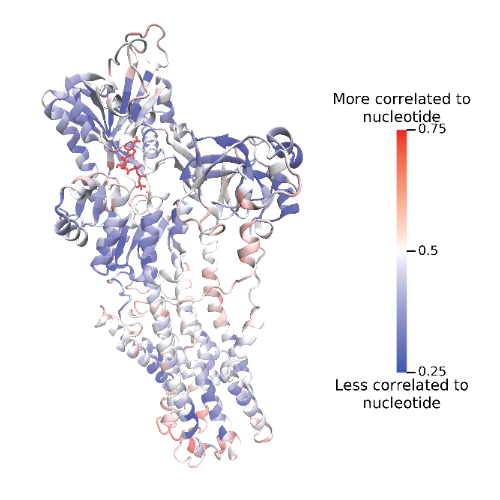
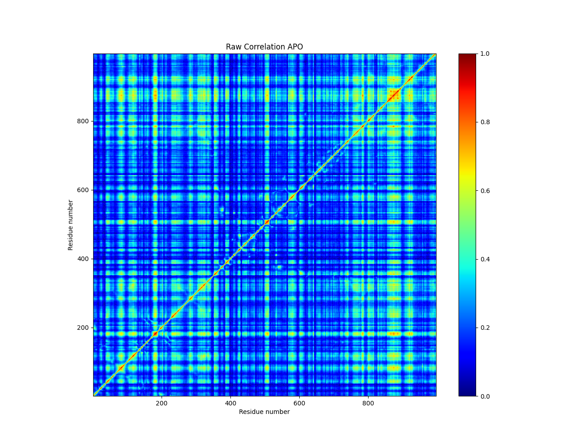

Introduction
============

Molecular Dynamics Simulations
------------------------------
The biological cell is composed of a myriad of complex molecular machinery in the form of biomolecules: proteins, nucleic acids, polysaccharides, phospholipids, metabolites, and others. A number of experimental methods based on microscopy, spectroscopy, and crystallography may be used to characterize the form and function of these biomolecules, yet no experimental method can yet fully characterize the details of all system's biomolecular structure, function, motion, and interactions. To bridge these gaps, one may employ computers in order to run simulations of these biomolecules. One of the most popular of these simulation methods, called *molecular dynamics* (MD), assumes a classical description of the system, where atoms are approximated as points of mass and charge, and where bonded forces are approximated as a series of mathematical terms.

The background and best practices knowledge needed to understand and employ MD simulations is beyond the scope of this manual. Yet when a simulation is run, it generates a *trajectory* - snapshots of the atomic positions of the system as they change with time. These trajectory files can be massive, containing a great deal of information. Once one has successfully finished a simulation, one encounters a serious problem: what does one do with all this data - how can it be utilized to generate helpful chemical and biological insights.

Many analysis methods exist for MD trajectories, and I make no attempt to elaborate them all here. However, one important class of analysis methods make use of *correlated motion* of particular parts of the biomolecule.

.. note::
  Two parts of a protein might move in "tandem", with some sort of "concerted motion". In this circumstance, we can say that these parts of the protein are "correlated" to one another.
  
Correlated motion within MD trajectories forms the basis of dynamical network analysis, which, among other things, is useful for analyzing allosteric communication within and between biomolecules (Figure 1). We will return to network analysis and allostery later. For now, let us consider the theoretical foundations of the NetSci method in the field of information theory, most specifically, the *mutual information* (MI) and the *generalized correlation* (GC).

   
   Figure 1: The SERCA pump protein with residues colored by correlated motion to a bound ATP nucleotide. The binding of ATP to this pump induces a conformational change (allosteric communication) that pumps a calcium ion across a sarcoplasmic reticulum membrane within cardiac muscle cells. Residues colored in red are highly correlated with the ATP nucleotide, while residues colored in blue have low or no correlation to ATP motion.

Mutual Information and Generalized Correlation
----------------------------------------------
At the discovery of the mathematical field of information theory in 1946, Claude Shannon presented the concept of MI :math:`I(X,Y)`, which is defined in terms of information entropy :math:`H`.

.. math::
  I(X,Y) = H(X) + H(Y) - H(X,Y)
  
In essence, the MI represents the amount of information that one may obtain about an unknown random variable :math:`Y` if one considers information about a known random variable :math:`X`, or vice versa. This quantity represents the strength of informational "connection" between the two random variables.

In theory, one would need to know the exact distributions of X and Y in order to exactly compute the MI. However, in practice, this is usually not possible. Therefore, many approximation schemes have been proposed for computing the MI. Notably, in 2008, Kraskov et al. proposed an algorithm that can estimate the MI of a set of data points based on a k-nearest neighbors formulation. It is this algorithm that NetSci has implemented on the GPU, and is intended for obtaining the MI of protein trajectories, though it can be used for any type of data.

The MI quantity will be a number between 0 and infinity. In can be convenient instead to use the GC, represented by the symbol :math:`r_{\textrm{MI}}(X, Y)`, which will be a number between 0 (uncorrelated) and 1 (perfectly correlated), and is equivalent to the r-coefficient commonly seen in linear regression.

.. math::
  r_{\textrm{MI}}(X, Y) = (1-e^{-\frac{2I(X,Y)}{d}})^{\frac{1}{2}}

The details of the derivations and usages of these concepts are vast. For more information, the following publications are likely to be good starting points:

* Stokely A, Votapka L, Hock M, Teitgen A, McCammon JA, McCullough A, Amaro R, NetSci: A Library for High Performance Biomolecular Simulation Network Analysis Computation. ChemRxiv. 2024; doi:10.26434/chemrxiv-2024-fjrpp This content is a preprint and has not been peer-reviewed.

* Kraskov, A.; Stogbauer, H.; Grassberger, P. Estimating Mutual Information. Physical Review E - Statistical Physics, Plasmas, Fluids, and Related Interdisciplinary Topics 2004, 69, 16.

* Lange, O. F.; Grubmuller, H. Generalized Correlation for Biomolecular Dynamics. Proteins: Structure, Function and Genetics 2006, 62, 1053–1061.

Allosteric Network Analysis
---------------------------
When one considers the GC of the motions of individual atoms or residues (nodes) detailed by a MD trajectory, one may consider the correlated motions between them, generating a pairwise matrix of nodes connected by edges of correlated motion (Figure 2). This collection of nodes and edges allows us to leverage the mathematical field of *graph theory*. Analysis of these graphs of correlated motion allow us to identify communities of closely correlated residues or atoms, and also communication pathways between allosteric sites.

   
   Figure 2: A generalized correlation matrix plot generated by a locally aligned trajectory of a MD simulation of the SERCA pump in the apo state.

All of this relies on the foundation of MI computation enabled by the estimation algorithm by Kraskov et al. The fast GPU implementation in NetSci will allow researchers to compute MI and GC to analyze correlation motion within proteins in a biophysical context, as well as the correlations within any other data set of interest in any other context as well.
