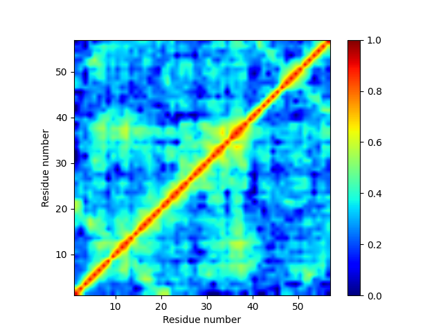
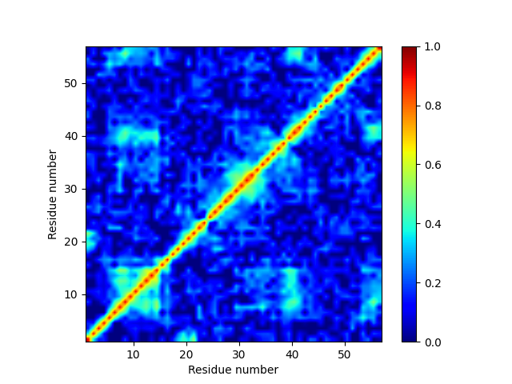

Tutorial 2: Generalized Correlation of a Protein Simulation
===========================================================

In this tutorial, we will analyze a short trajectory of a 
protein simulation in order to compute the generalized correlation
of its motion. We will also look at the importance of doing
a local alignment.

Make sure to activate the NetSci conda environment::

  conda activate netsci

Protein G Generalized Correlation with Global Alignment
-------------------------------------------------------

First, we will perform generalized correlation analysis on a trajectory
that has been stripped down to only alpha carbons, and has been RMSD
aligned. (This can be done using cpptraj or VMD)

One must download the trajectory and topology files from the following two
links

:download:`protG_short.pdb <media/protG_short.pdb>`

:download:`protG_short.dcd <media/protG_short.dcd>`

The following python script will perform a generalized correlation analysis
on this trajectory::

    import time

    import numpy as np

    import cuarray
    import netchem
    import netcalc

    starttime = time.time()
    trajectory_file = "protG_short.dcd"
    topology_file = "protG_short.pdb"
    first_frame = 0
    last_frame = 99

    print("Creating netchem graph")
    graph = netchem.Graph()
    graph.init(
        trajectoryFile=trajectory_file,
        topologyFile=topology_file,
        firstFrame=first_frame,
        lastFrame=last_frame,
    )

    # Output correlation matrix
    R = cuarray.FloatCuArray()

    # Correlation pairs to compute
    ab = cuarray.IntCuArray()
    num_nodes = graph.numNodes()
    num_node_pairs = num_nodes**2

    # Define all pair correlations that will be computed
    ab.init(num_node_pairs, 2)
    for i in range(num_nodes):
        for j in range(num_nodes):
            node_pair_index = i*num_nodes + j
            ab[node_pair_index][0] = i
            ab[node_pair_index][1] = j
            
    # Number of data points
    n = graph.numFrames()

    # Dimensionality of the data
    d = 3
    
    xd = 2

    # K-nearest-neighbors
    k = 6

    # CUDA platform
    platform = 0

    # Compute generalized correlation and output to proteinG_R
    print("Performing generalized correlation computation "\
          f"on {n} data points with {num_nodes} nodes.")
    print(f"Time: {time.time()-starttime:.3f} s.")
    netcalc.generalizedCorrelation(
        X=graph.nodeCoordinates(),
        R=R,
        ab=ab,
        k=k,
        n=n,
        d=d,
        xd=xd,
        platform=platform,
    )

    # Gen. Corr. in numpy array object
    R_np = R.toNumpy2D().reshape(num_nodes, num_nodes)
    corr_matrix_filename = "proteinG_corr_matrix.txt"
    print("Saving matrix to:", corr_matrix_filename)
    np.savetxt(corr_matrix_filename, R_np)
    print(f"Total time: {time.time()-starttime:.3f} s.")

This will generate and save a N by N array of correlation values to the file
named 'proteinG_corr_matrix.txt'. The results can be visualized with the
following script::

    import numpy as np
    import matplotlib.pyplot as plt

    R_np = np.loadtxt("proteinG_corr_matrix.txt")

    # Ranges of data
    num_nodes = 56

    R_np = np.flip(R_np, axis=0)

    R_figure_x = [i for i in range(num_nodes)]
    R_figure_y = [i for i in range(num_nodes)]

    im = plt.imshow(R_np, vmin=0.0, vmax=1.0, extent=[1, num_nodes+1, 1, num_nodes+1],
                    cmap=plt.cm.jet)
    im.set_interpolation('bilinear')
    plt.xlabel("Residue number")
    plt.ylabel("Residue number")
    cbar = plt.colorbar(im)
    plt.show()
    
The script should produce a plot like this:

   
   Figure 1: A generalized correlation plot of 100 frames of a trajectory of protein G. 
   This was done with a global alignment.
   
Although this plot looks pretty good, larger proteins will show spurious correlations
near their extremities, which is caused by a faulty alignment procedure, which
will be corrected in the next section.

Protein G Generalized Correlation with Local Alignment
------------------------------------------------------

Now we will modify the generalized correlation script to perform a local alignment.
The improvement will not be very obvious for a small protein like protein G, but
for larger proteins, will prevent spurious correlations from appearing when global
motions occur due to the RMSD alignment.

The following Python script is similar to the previous one, with some changes in how
the data inputs to the generalized correlation function are defined::

    import time

    import numpy as np
    import mdtraj as md

    import cuarray
    import netchem
    import netcalc

    starttime = time.time()
    trajectory_file = "protG_short.dcd"
    topology_file = "protG_short.pdb"
    first_frame = 0
    last_frame = 99
    num_frames = last_frame - first_frame + 1
    local_dist_cutoff = 0.75 # in nm

    print("Creating netchem graph")
    graph = netchem.Graph()
    graph.init(
        trajectoryFile=trajectory_file,
        topologyFile=topology_file,
        firstFrame=first_frame,
        lastFrame=last_frame,
    )

    # Output correlation matrix
    R = cuarray.FloatCuArray()

    # Correlation pairs to compute
    ab = cuarray.IntCuArray()
    num_nodes = graph.numNodes()
    num_node_pairs = num_nodes**2

    # Define all pair correlations that will be computed
    ab.init(num_node_pairs, 2)
    for i in range(num_nodes):
        for j in range(num_nodes):
            node_pair_index = i*num_nodes + j
            ab[node_pair_index][0] = i
            ab[node_pair_index][1] = j
            
    # Number of data points
    n = graph.numFrames()

    # Dimensionality of the data
    d = 3

    xd = 2

    # K-nearest-neighbors
    k = 6

    # CUDA platform
    platform = 0

    def residue_com(traj, res, frame=0):
        first_frame_coords = traj.xyz[frame,:,:]
        com = np.array([0.0, 0.0, 0.0])
        total_mass = 0.0
        for k, atom1 in enumerate(res.atoms):
            mass = atom1.element.mass
            com += mass * first_frame_coords[atom1.index, :]
            total_mass += mass
            
        com /= total_mass
        return com

    #globally_aligned_nodes = graph.nodeCoordinates()
    locally_aligned_nodes = np.zeros((num_nodes, 3*num_frames)).astype(np.float32)
    print(f"loading files {trajectory_file} and {topology_file}.")
    traj = md.load(trajectory_file, top=topology_file)
    print("constructing local alignments.")
    for i, res1 in enumerate(traj.topology.residues):
        atom1_coords = residue_com(traj, res1)
        close_atom_indices = []
        for j, res2 in enumerate(traj.topology.residues):
            if i == j: continue
            atom2_coords = residue_com(traj, res2)
            dist = np.linalg.norm(atom2_coords - atom1_coords)
            if dist <= local_dist_cutoff:
                close_atom_indices.append(j)
        
        traj.superpose(traj, atom_indices=close_atom_indices, ref_atom_indices=close_atom_indices)
        #positions = traj.xyz[:,i,:] - traj.xyz[0,i,:]
        atom1_coords_aligned = residue_com(traj, res1)
        positions = np.zeros((traj.n_frames, 3))
        for L in range(traj.n_frames):
            positions[L,:] = residue_com(traj, res1, frame=L) - atom1_coords_aligned
        
        locally_aligned_nodes[i, 0:num_frames] = positions[:,0]
        locally_aligned_nodes[i, num_frames:2*num_frames] = positions[:,1]
        locally_aligned_nodes[i, 2*num_frames:3*num_frames] = positions[:,2]
        
    graph.nodeCoordinates().fromNumpy2D(locally_aligned_nodes.astype(np.float32))

    # Compute generalized correlation and output to proteinG_R
    print("Performing generalized correlation computation "\
          f"on {n} data points with {num_nodes} nodes.")
    print(f"Time: {time.time()-starttime:.3f} s.")
    netcalc.generalizedCorrelation(
        X=graph.nodeCoordinates(),
        R=R,
        ab=ab,
        k=k,
        n=n,
        d=d,
        xd=xd,
        platform=platform,
    )

    # Gen. Corr. in numpy array object
    R_np = R.toNumpy2D().reshape(num_nodes, num_nodes)
    corr_matrix_filename = "proteinG_corr_matrix.txt"
    print("Saving matrix to:", corr_matrix_filename)
    np.savetxt(corr_matrix_filename, R_np)
    print(f"Total time: {time.time()-starttime:.3f} s.")
    
Try running the above script, and then re-plotting the results using the same plotting
script as before::

    import numpy as np
    import matplotlib.pyplot as plt

    R_np = np.loadtxt("proteinG_corr_matrix.txt")

    # Ranges of data
    num_nodes = 56

    R_np = np.flip(R_np, axis=0)

    R_figure_x = [i for i in range(num_nodes)]
    R_figure_y = [i for i in range(num_nodes)]

    im = plt.imshow(R_np, vmin=0.0, vmax=1.0, extent=[1, num_nodes+1, 1, num_nodes+1],
                    cmap=plt.cm.jet)
    im.set_interpolation('bilinear')
    plt.xlabel("Residue number")
    plt.ylabel("Residue number")
    cbar = plt.colorbar(im)
    plt.show()

The following plot is produced:

   
   Figure 1: A generalized correlation plot of 100 frames of a trajectory of protein G
   computed with a local alignment procedure.
   
Notice that far fewer instances of correlated motions are found after the local 
alignment - this result is probably more correct than the result obtained with
the global alignment.

